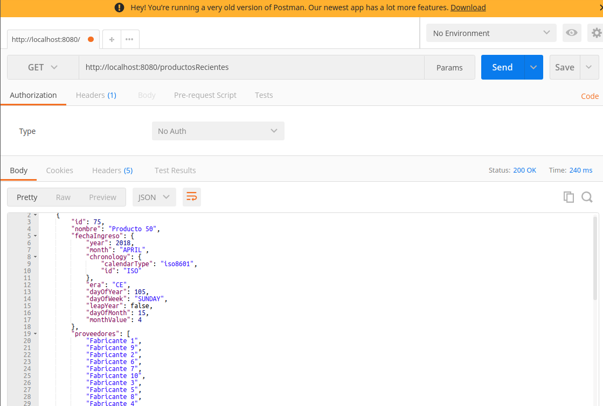

# Productos (problema N + 1 queries)

Este ejemplo permite ver el problema de los (N + 1) queries. Consiste en un servicio REST hecho con XTRest, que tiene un solo endpoint: el que permite consultar los productos más recientes.

## Dominio

Tenemos productos y fabricantes, que cumplen una relación many-to-many: un producto tiene muchos fabricantes y un fabricante tiene muchos productos. No hay relación en cascada: el producto y el fabricante tienen ciclos de vida separados.

## Generación del juego de datos

La clase **ProductosBootstrap** genera el juego de datos inicial cuando no hay fabricantes:

- construye una lista de 25 fabricantes
- y 50 productos: a la mitad les pone los primeros 10 fabricantes y a la otra mitad les asigna los fabricantes ubicados en las posiciones 11, 12, 13, 14 y 15
  
La segunda vez que corre pregunta si hay fabricantes cargados, de ser así saltea este paso.

## Inicialización de la aplicación

La clase **ProductosController** de XTRest 

- manda a generar el juego de datos
- y levanta el servidor que escucha pedidos en el puerto 8080

## Endpoint que trae los productos recientes

El único endpoint que publica el web server es `/productosRecientes`, que realiza el método GET:

```xtend
@Get("/productosRecientes")
def Result buscarPeliculas() {
	ok(RepoProductos.instance.productosRecientes.toJson)
}
```

## Variante con n + 1 queries 

Los productos recientes se obtienen en base a la siguiente consulta al repo:

```xtend
def getProductosRecientes() {
	val criteria = entityManager.criteriaBuilder
	val preparedQuery = criteria.createQuery(typeof(Producto))
	val from = preparedQuery.from(Producto)
	preparedQuery.select(from)
	preparedQuery.orderBy(criteria.asc(from.get("fechaIngreso")))
	val query = entityManager.createQuery(preparedQuery)
	query.maxResults = 5
	query.resultList
}
```

- el query lo ordena por fecha de ingreso ascendente (`criteria.asc`)
- toma los primeros 5 resultados (`maxResults = 5`)

Cuando hacemos la consulta

```bash
http://localhost:8080/productosRecientes
```



hay 6 queries hechos a la base:

```sql
-- Hibernate: query del producto  
    select
        producto0_.id as id1_1_,
        producto0_.fechaIngreso as fechaIng2_1_,
        producto0_.nombre as nombre3_1_ 
    from
        Producto producto0_ 
    order by
        producto0_.fechaIngreso asc limit ?
-- Hibernate: query 1 del fabricante 
    select
        proveedore0_.Producto_id as Producto1_2_0_,
        proveedore0_.proveedores_id as proveedo2_2_0_,
        fabricante1_.id as id1_0_1_,
        fabricante1_.nombre as nombre2_0_1_ 
    from
        Producto_Fabricante proveedore0_ 
    inner join
        Fabricante fabricante1_ 
            on proveedore0_.proveedores_id=fabricante1_.id 
    where
        proveedore0_.Producto_id=?
-- Hibernate: query 2 del fabricante 
    select
        proveedore0_.Producto_id as Producto1_2_0_,
        proveedore0_.proveedores_id as proveedo2_2_0_,
        fabricante1_.id as id1_0_1_,
        fabricante1_.nombre as nombre2_0_1_ 
    from
        Producto_Fabricante proveedore0_ 
    inner join
        Fabricante fabricante1_ 
            on proveedore0_.proveedores_id=fabricante1_.id 
    where
        proveedore0_.Producto_id=?
-- Hibernate: query 3 del fabricante
    select
        proveedore0_.Producto_id as Producto1_2_0_,
        proveedore0_.proveedores_id as proveedo2_2_0_,
        fabricante1_.id as id1_0_1_,
        fabricante1_.nombre as nombre2_0_1_ 
    from
        Producto_Fabricante proveedore0_ 
    inner join
        Fabricante fabricante1_ 
            on proveedore0_.proveedores_id=fabricante1_.id 
    where
        proveedore0_.Producto_id=?
-- Hibernate: query 4 del fabricante
    select
        proveedore0_.Producto_id as Producto1_2_0_,
        proveedore0_.proveedores_id as proveedo2_2_0_,
        fabricante1_.id as id1_0_1_,
        fabricante1_.nombre as nombre2_0_1_ 
    from
        Producto_Fabricante proveedore0_ 
    inner join
        Fabricante fabricante1_ 
            on proveedore0_.proveedores_id=fabricante1_.id 
    where
        proveedore0_.Producto_id=?
-- Hibernate: query 5 del fabricante
    select
        proveedore0_.Producto_id as Producto1_2_0_,
        proveedore0_.proveedores_id as proveedo2_2_0_,
        fabricante1_.id as id1_0_1_,
        fabricante1_.nombre as nombre2_0_1_ 
    from
        Producto_Fabricante proveedore0_ 
    inner join
        Fabricante fabricante1_ 
            on proveedore0_.proveedores_id=fabricante1_.id 
    where
        proveedore0_.Producto_id=?
```

La lista de proveedores es lazy, pero se está trayendo los nombres de los proveedores como propiedad serializable: 

```xtend
@JsonIgnore
@ManyToMany(fetch = FetchType.LAZY)
Set<Fabricante> proveedores

@JsonProperty("proveedores")
def Set<String> getNombresDeProveedores() {
	proveedores.map [ prov | prov.nombre ].toSet
}
```

Para evitar que el query haga N + 1 llamadas, vamos a definir una operación fetch desde Producto a Fabricante:

```xtend
def getProductosRecientes() {
	val criteria = entityManager.criteriaBuilder
	val preparedQuery = criteria.createQuery(typeof(Producto))
	val fromProducto = preparedQuery.from(Producto)
	// evita n + 1 queries
	fromProducto.fetch("proveedores")
	//
	preparedQuery.select(fromProducto)
	preparedQuery.orderBy(criteria.asc(fromProducto.get("fechaIngreso")))
	val query = entityManager.createQuery(preparedQuery)
	query.maxResults = 5
	query.resultList
}
```

Ahora sí, al disparar la consulta nuevamente, se resuelve todo en un único query:

```sql
Hibernate: 
    select
        producto0_.id as id1_1_0_,
        fabricante2_.id as id1_0_1_,
        producto0_.fechaIngreso as fechaIng2_1_0_,
        producto0_.nombre as nombre3_1_0_,
        fabricante2_.nombre as nombre2_0_1_,
        proveedore1_.Producto_id as Producto1_2_0__,
        proveedore1_.proveedores_id as proveedo2_2_0__ 
    from
        Producto producto0_ 
    inner join
        Producto_Fabricante proveedore1_ 
            on producto0_.id=proveedore1_.Producto_id 
    inner join
        Fabricante fabricante2_ 
            on proveedore1_.proveedores_id=fabricante2_.id 
    order by
        producto0_.fechaIngreso asc
```